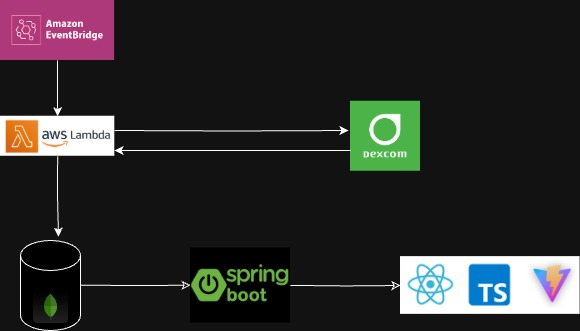
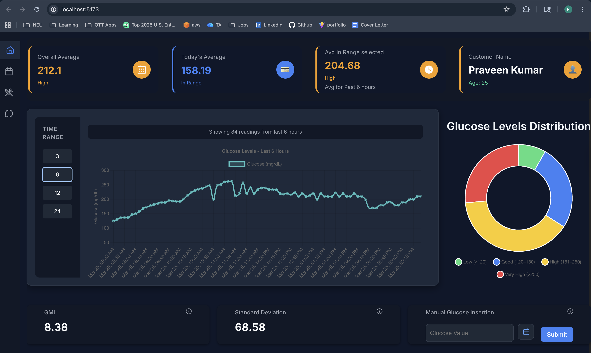
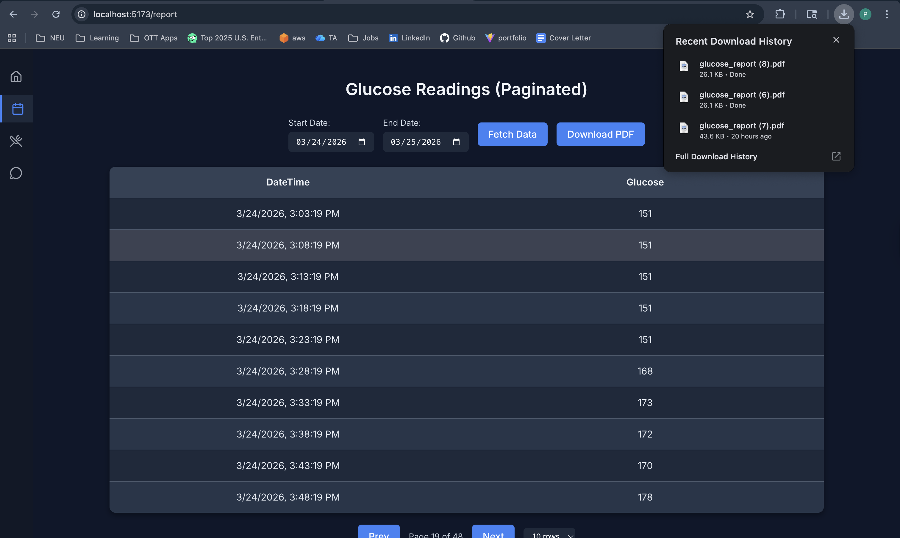
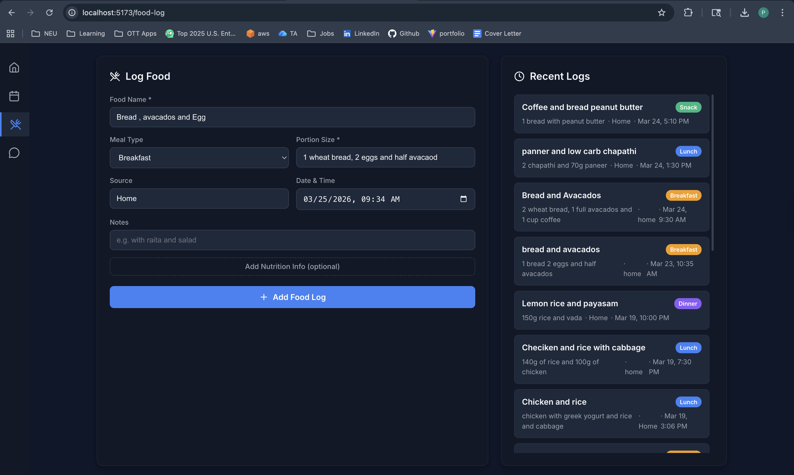
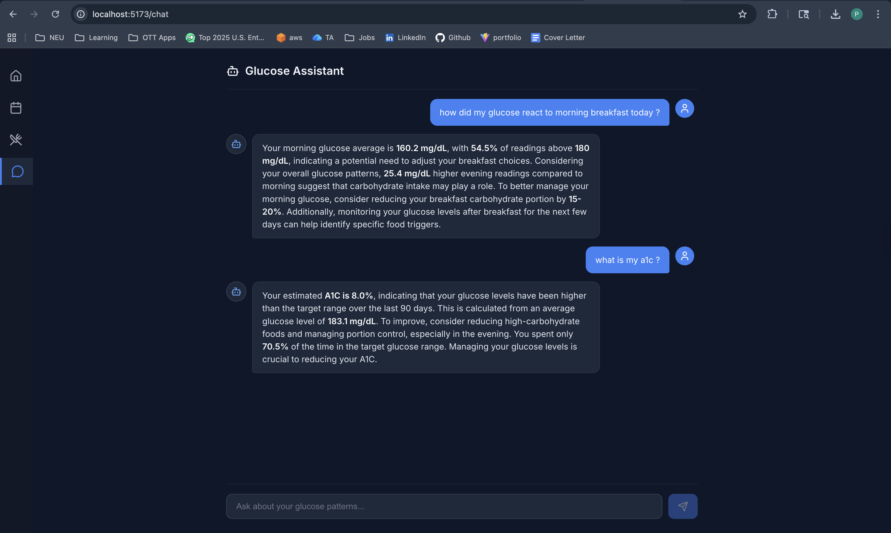

# Glucose

Full-stack glucose monitoring application with a React dashboard, Spring Boot API, MongoDB storage, food logging, exportable reports, and an AI assistant for personalized glucose analysis.

## Current Feature Set

- Live dashboard with glucose trend charts for the last `3`, `6`, `12`, or `24` hours
- Summary cards for overall average, today's average, selected-range average, GMI, and glucose standard deviation
- Glucose distribution pie chart across low, in-range, high, and very high buckets
- Manual glucose entry from the UI for backfilling readings
- Report page with date-range filtering, paginated reading history, and PDF export
- Food logging with meal type, portion size, source, notes, and optional carbs, protein, and fiber
- AI chat assistant that can answer questions about latest readings, food-specific spikes, time-of-day patterns, meal-type comparisons, time-range comparisons, and estimated A1C trends
- Knowledge-base ingestion plus vector search for retrieval-augmented chat responses
- Automatic saving of chat-derived insights into the knowledge base for future reuse

## Architecture

This repository contains two main app layers:

- `front-end/`: React 19 + Vite client with dashboard, reports, food log, and chat pages
- `src/main/java/com/example/demo/`: Spring Boot API serving glucose metrics, reports, food logs, knowledge ingestion, and chat

Supporting services:

- MongoDB stores glucose readings in `Dexcom_Data`, meals in `food_logs`, and vectorized knowledge in `knowledge_base`
- Groq's OpenAI-compatible chat API powers assistant responses
- Hugging Face embeddings power semantic search over the knowledge base
- iText generates downloadable PDF reports

Architecture to Explain data ingestion in MongoDB:



## Tech Stack

### Frontend

- React 19
- TypeScript
- Vite
- React Router
- Chart.js via `react-chartjs-2`

### Backend

- Java 17
- Spring Boot 3.2
- Spring Data MongoDB
- Maven
- iText 7

### Data and AI

- MongoDB / MongoDB Atlas
- Hugging Face Inference API for embeddings
- Groq API with `llama-3.3-70b-versatile`

## Application Demo:







## Project Structure

```text
.
├── front-end/
│   ├── components/
│   └── src/
├── src/main/java/com/example/demo/
│   ├── Controller/
│   ├── Model/
│   ├── Repository/
│   └── Service/
├── src/main/resources/application.properties
├── pom.xml
└── README.md
```


## Local Setup

### Prerequisites

- Java 17
- Node.js 18+
- npm
- MongoDB or MongoDB Atlas

### 1. Configure the backend

The Spring Boot app reads these environment variables:

```bash
APPLICATION_PORT=8999
DB_HOST=<your-mongodb-connection-string>
HF_TOKEN=<your-hugging-face-token>
GROK_TOKEN=<your-groq-token>
```

Notes:

- `HF_TOKEN` and `GROK_TOKEN` are required for chat and knowledge-base features
- Dashboard, report, and food-log features can still work without AI credentials
- `GEMINI_KEY` is present in `application.properties`, but the current code path uses `GROK_TOKEN`

Start the backend from the repository root:

```bash
./mvnw spring-boot:run
```

### 2. Configure the frontend

The Vite app expects per-endpoint URLs in `front-end/.env`. For local development, they typically point to `http://localhost:8999`:


Start the frontend:

```bash
cd front-end
npm install
npm run dev
```

## Knowledge Base Notes

- Knowledge documents are stored in the `knowledge_base` collection
- Semantic search expects a MongoDB vector index named `vector_index` on the `embedding` field
- Chat answers can auto-save short insights back into the knowledge base as `auto_insight` entries
